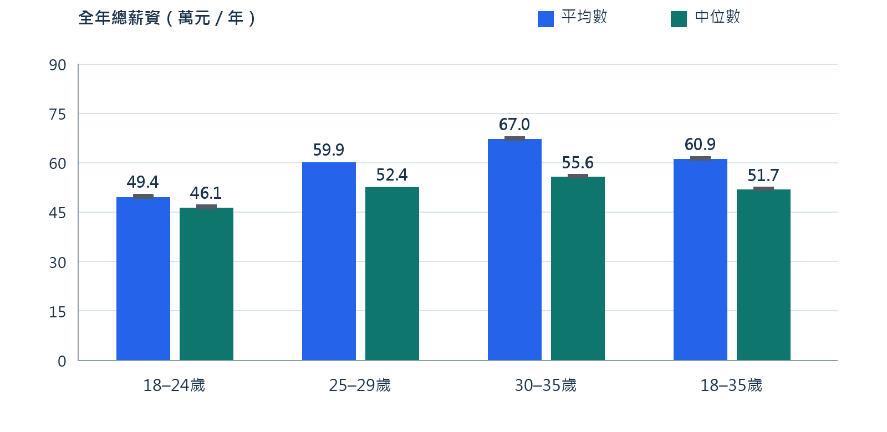
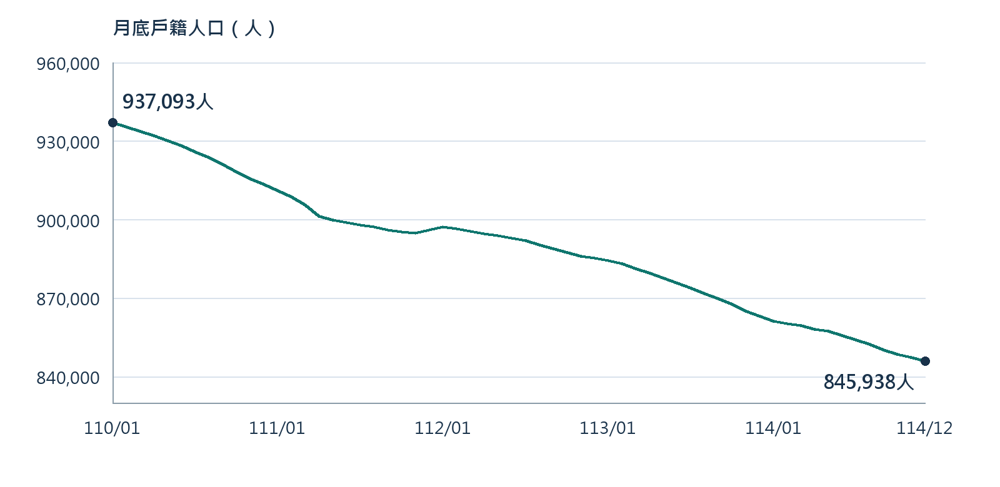
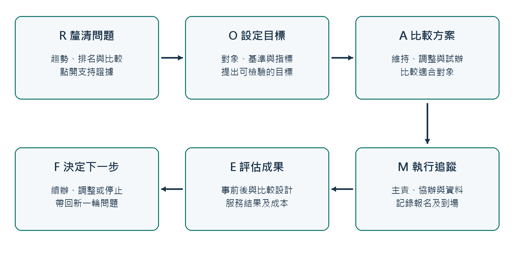
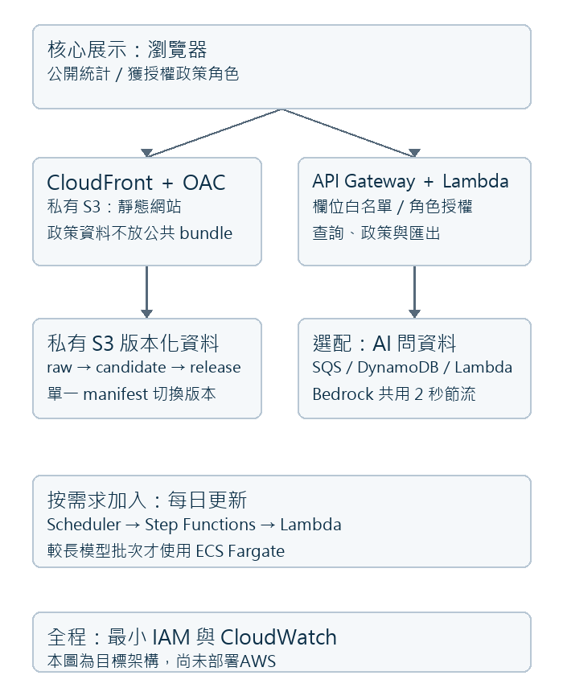
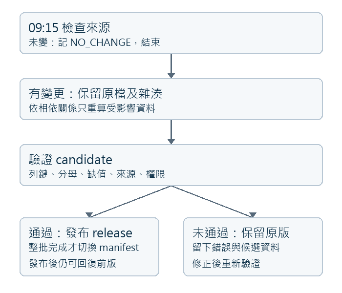

# 新北青年政策決策工作台

競賽規劃與操作說明書

文件版 COMP V1.0，2026年9月11日。介面基準 G6 UI V5.32。對象為政策決策者、競賽評審與後續 Kiro 開發者。

## 1 解決方案說明

政策承辦人常遇到三個問題：人口、勞動與薪資的對象不同；行政區差異難以快速比較；圖表雖多，政策選項卻缺乏可點查的依據。本案把資料整理、圖表比較與政策討論放在同一個工作台，讓使用者由問題進入證據，再選擇值得評估的介入方式。

使用者先看每月青年戶籍人口，再進入全市或29行政區的年度比較。教育、婚姻、勞動、行業和薪資各自保留資料身分。政策研判頁以 R 問題、O 目標、A 選項、M 追蹤、E 評估與 F 後續調整串起流程。點擊一句數據敘述，就可從右側開啟直接支持它的比較圖及資料表。

例如「青年人口成長居前段」與「列管據點少」可形成服務需求盤點題目；要不要新設據點，還需比較現有服務、交通與方案使用資料。婚姻比例則用來描述族群組成，不把未婚或離婚本身視為政策失敗。這些區分讓政策選項可討論，也讓證據可以回頭確認。

|評分面向|本案可提供的證據|本次狀態|
|---|---|---|
|主題契合度35%|青年人口、職涯及發展議題；行政區與全市分流；ROAMEF政策流程|既有介面及資料保留|
|完成度25%|圖表互動、篩選、資料表、匯出、權限、政策圖表連結|原始碼完整接手；競賽部署待完成|
|資料應用性20%|三母體、年齡拆分、教育×婚姻、行業薪資、逐列來源及兩份排名|資料快照與方法納入|
|技術可行性20%|最小AWS架構、服務動作對照、建置測試及Kiro任務|本次交付規格；不冒充雲端已驗證|

上述權重來自使用者提供的評分資訊；兩份環境規範附件未另列評分權重。

## 2 既有成果與競賽版本的關係

既有程式、資料包、原始檔與 Sites 遠端全部保留。本次以獨立目錄和新的私人 GitHub 儲存庫建立競賽接手版本，不覆蓋既有成果，也不把新版文件當成正式網站已發布紀錄。

|層次|保留內容|本次處理|
|---|---|---|
|既有完整包|01、02等分層、原始資料、既有報告、查核與程式副本|完整保留，不覆寫|
|本次資料版|目前三母體與衍生快照、修正版排名、來源及Code Book|另行整理並核對檔案雜湊|
|GitHub程式版|V5.32介面、後端權限、匯出、模型及測試程式|去除實際身分與資源綁定，另立Git歷史|
|競賽AWS版|部署目標、IAM動作、資料流程及驗收條件|規劃完成，待Kiro移植及授權部署|

薪資保留官方彙整資料及有標記的模型估計。使用者已確認可納入，本文件記錄此裁示，不將其寫成主辦方書面核可。實際登入Email、姓名、憑證和個人輸入不進競賽資料層。

## 3 操作流程與章節對照

1. 進入首頁，選年齡、性別與月度呈現方式，看青年人口變化。
2. 從主題入口選全市戶籍、29行政區、勞動、青年行業或薪資；以各圖篩選條件閱讀同口徑比較。
3. 選政策研判的行政區或全市分流，再選年度與年齡。查看議題分類原因與支持圖表。
4. 沿 R、O、A、M、E、F 比較方案與追蹤指標。沒有觸發優先盤點的議題，仍可看選項資訊，但不能寫成已符合介入門檻。
5. 在自訂分析頁組合可相容的維度；在資料匯出頁選母體、期間、維度與欄位。政策內容及其匯出僅供獲授權角色。

後續第4至11章沿用已完成研究報告的母體、資料、方法、上下限數值及政策邏輯。本次新增第12章以後的競賽限制、AWS架構、Kiro任務和GitHub交付。沿用數值屬既有快照，不表示9月11日重新取得所有官方資料。

## 4　三母體與可比較範圍

| 母體 | 納入對象與時間 | 地理與限制 |
| --- | --- | --- |
| 戶籍人口 | 設籍該地區的現住登記人口；年末或月末存量 | 全新北市與29區；不等同實際常住人口 |
| 民間人口與勞動 | 常住民間人口調查，以15歲以上為基本範圍，本案取18–35歲全年平均。排除武裝勞動力、監管及其他調查未涵蓋者 | 全市；居住地口徑，不是工作地分布 |
| 受僱員工薪資 | 工作場所地區口徑之受僱員工全年總薪資；使用官方統計涵蓋範圍 | 全市；不代表設籍青年所得，也不包含所有自營者或失業者 |

### 四個年齡群

18–24、25–29、30–35是互斥子群；18–35是三者的聯集。不能把四組加總。男女合計同樣不能再加上男與女。官方完整五歲組能直接加總的25–29歲，與需拆開18–19、30–34及35歲的群組，保留不同資料身分。

### 跨資料比較的正確方式

- 各母體先在自己的分母內比較年度、年齡或性別，再在政策敘述中並列觀察。

- 行政區政策僅使用行政區戶籍、教育、婚姻、面積與服務快照；不將全市就業或薪資分配到各區。

- 勞保登記地址的提繳資料與工作場所薪資可作輔助對照，但登記地不保證每位員工實際工作地相同。

## 5　最新資料盤點

| 資料 | 期別與粒度 | 列數／可用範圍 |
| --- | --- | --- |
| 戶籍長表 | 110–114年；全市+29區、4年齡、男女與合計 | 39,150列 |
| 勞動長表 | 110–114年；全市、4年齡、合計、9指標 | 180列 |
| 薪資長表 | 110–113年；全市、4年齡、平均數/中位數 | 32列；114不代填 |
| 月人口 | 110/01–114/12；30地理×4年齡×3性別 | 21,600列，60個月末 |
| 教育×婚姻 | 30地理×5年×4年齡×3性別×5教育×4婚姻 | 36,000列 |
| 居住青年行業 | 5年×4青年組×3性別×19行業 | 1,140青年列；另285全年齡輔助 |
| 青年行業薪資 | 113年×19行業×4青年組 | 76格；68格可估，8格不適用 |
| 政策服務與曝光 | 依官方項目、年度及指標的異質記錄 | 204列；不是第四種人口 |
| 行政區排名 | 5年×29區×4年齡×3性別 | 1,740列；採交付修正版 |
| 全市年度與結構排名 | 多主題指標的聯集，非單一完整交叉 | 3,255列 |

核心三份CSV合計39,362列。網站JSON將同條件多個指標放在同一物件，因此物件數與長格式列數不同。資料包內重複保存CSV、JSON及原檔是為了追溯和啟動，不能把檔案列數相加當成人口或樣本數。

## 5.1　主表列數如何形成

| 戶籍指標區塊 | 類別相乘 | 列數 |
| --- | --- | --- |
| 戶籍人口數 | 5年×30地理×4年齡×3性別 | 1,800 |
| 青年占人口比率 | 5×30×4×3 | 1,800 |
| 青年人口密度 | 5×30×4×3 | 1,800 |
| 男女結構占比 | 5×30×4×2性別 | 1,200 |
| 官方土地面積 | 5×30；不按青年年齡性別重複 | 150 |
| 教育人數與比例 | 5×30×4×3×5教育×2統計量 | 18,000 |
| 婚姻人數與比例 | 5×30×4×3×4婚姻×2統計量 | 14,400 |
| 合計 | 分區塊加總 | 39,150 |

勞動長表：5年度 × 4年齡 × 9指標 × 1全市 × 1男女合計 = 180列。核心青年勞動表尚未提供完整男女拆分；青年行業表另有性別模型資料，不可將兩者視為同一可用欄位集合。

薪資長表：4年度 × 4年齡 × 2統計量 × 1全市 × 1男女合計 = 32列。平均數16列、中位數16列；其中25–29歲8列為官方原生組別，其餘24列為模型結果。

| 全市排名主題 | 列數 |
| --- | --- |
| 戶籍人口 | 180 |
| 教育程度 | 300 |
| 婚姻狀態 | 240 |
| 男女結構 | 40 |
| 民間人口與勞動市場 | 180 |
| 居住於新北市青年就業者行業 | 2280 |
| 受僱員工薪資 | 35 |

## 6　欄位與來源追溯

核心長表用record_id識別一個統計列，再用年度、母體、地理、年齡、性別、分類及指標描述它。每次分析應同時讀取value、unit、formula_zh、method_code與來源，不只拿數值欄。

| 欄位群 | 用途 |
| --- | --- |
| 年度與時間 | roc_year、source_period、period_basis；分開年末、月末及全年平均 |
| 母體與地理 | universe_code、geography_code/name/level/role；避免跨母體合併 |
| 類別 | age_band、sex_code/name、category_dimension/category_code |
| 計算 | value、unit、numerator、denominator、formula_zh |
| 方法身分 | value_origin、method_code/name、model_version、uncertainty_low/high/type |
| 來源與查核 | source_alias/url/snapshot/sha256、retrieved_at、publish_status、qa_status |

### 一個source_alias不代表只用一張表

勞動母體由官方年報、年齡表及校準/拆分結果形成。04來源主檔有15列；05資料列來源關聯有74,030列，用來展開同一結果所依賴的主表、輔助表與對照表。網站另有延伸資料metadata，須與09快照及11來源清冊一起讀，不能只看三CSV的簡寫來源。

來源索引提供可點開的官方頁面；實際下載URL、快照、SHA-256及抓取日以原資料欄位和11逐檔對應為準。本報告未把今天網頁內容變動視為舊快照已更新。

## 7　人口與教育婚姻估計方法

### 直接加總

可取得單一年齡的人口，對所選年齡、性別與行政區直接加總。全市人口等於29區加總。人口密度為該族群人數除以官方土地面積；青年占比為青年人數除以同區、同年度、同性別的全年齡戶籍人口。[S01、S10]

### PCLM年齡拆分

當官方只提供寬年齡組時，先用PCLM估計非負單一年齡輪廓。其概念為：以合成矩陣C把細年齡估計μ加回官方寬組；μ = exp(Bθ)，在配合官方組別總數的同時，用二階差分懲罰控制曲線過度起伏。平滑參數與主模型版本依包內程式，不另自行更換。

### IPF邊際校準

IPF交替按列、欄的官方合計調整種子表，使估計維持已知人口與分類邊際。全市PCLM提供年齡結構種子，行政區的教育、婚姻與年齡性別邊際限制最後的分配。邊際吻合不表示每個細格都是直接觀察值。

### 教育與婚姻交叉

教育五類、婚姻四類的聯合表保留交叉關係。每個婚姻占比的分母是同年、同地區、同年齡性別與同教育類別的人口。25–29歲可使用官方完整五歲組；其他青年端點經模型拆分。37個分母為0的群組不作有效比例比較。[S02、S03]

## 7.1　勞動年齡拆分與比率

勞動統計使用民間人口調查的全年平均；先拆分人口P、勞動力LF、就業E與失業U等數量，再推得非勞動力及比率。PCLM為主要方案，Sprague年齡拆分及非負/邊際修正作敏感度比較，保留兩種方案差異。25–29歲完整組沿用官方值。[S04]

| 指標 | 計算式 | 本包單位 |
| --- | --- | --- |
| 民間人口 | P | 千人 |
| 勞動力 | LF = E + U | 千人 |
| 非勞動力 | P − LF | 千人 |
| 失業率 | U ÷ LF × 100 | % |
| 勞動力參與率 | LF ÷ P × 100 | % |
| 就業人口比率 | E ÷ P × 100 | % |
| 勞動力中就業占比 | E ÷ LF × 100 | % |

就業人口比率與勞動力中就業占比不同。例如114年18–35歲分別為77.93%與94.44%；分母一個是民間人口，一個是勞動力。失業率5.56%只與後者互補至100%。

青年行業另接官方全年齡行業與寬年齡行業表，用PCLM及IPF校準到既有青年就業母數。5年、19行業、男女與4青年組提供1140列模型分析；285筆全年齡表作輔助約束。這描述居住於新北市的就業者，不能推論每個行業工作場所都在新北市。

## 7.2　薪資平均數與中位數

### 平均數

以官方年齡與地區全年總薪資平均數為錨點，搭配勞保年齡別人數與提繳工資輪廓進行PCLM比例校準，將寬年齡分配至18–24、25–29、30–35及18–35歲。原生25–29歲值不重新標成模型。[S05–S07]

### 中位數

官方寬組的平均數/中位數關係提供分布形狀。模型把此關係轉移到細年齡估計，用對數常態假設形成各組分布，再以PCLM人數權重合成累積分布，求F(x)=0.5。合併中位數不是把各組中位數做加權平均。

### 行業薪資與提繳工資

113年青年行業薪資以新北市年齡別平均數為錨，結合全國行業年齡相對薪資輪廓估計。19類中17類可用，農林漁牧及公共行政等不適用類別留缺值。114年全年齡行業提繳人數僅作模型輔助權重，屬跨年度代理，不能說成114年青年薪資或113年青年行業人數。

「平均提繳工資」是申報提繳工資級距的平均，受申報範圍、級距與上限影響。它不是由提繳金額精確回推的實領平均薪資。按事業單位登記地址彙整也不等於每位員工工作地點完全一致。[S08、S09]

### 可延伸指標

平均數減中位數為差額；平均數除中位數為分布偏斜的代理比值，而非第三階動差的統計偏度。年成長率用同口徑年度值計算；中位數與行業模型包絡保留，不能把假設當成觀察分布。

## 8　最低值與最高值的定義

本包的uncertainty_low與uncertainty_high主要是模型替代方案的包絡。對同一指標，收集主估計及指定替代方法/校準情境的數值，最低值取最小，最高值取最大。官方直接值可能上下限相同；官方未提供區間的薪資原生值則留空。

| 方法 | 上下限取得方式 | 應如何解讀 |
| --- | --- | --- |
| 直接加總或官方原生 | 單一年齡加總可同值；未提供區間者留空 | 不是宣稱調查沒有抽樣誤差 |
| 戶籍教育/婚姻PCLM+IPF | 主種子與替代拆分/校準結果取包絡 | 反映模型選擇，不是抽樣95%信賴區間 |
| 勞動PCLM與Sprague | 逐方案先算人數和比率，再取最小/最大 | 不把分子分母極值隨意交叉拼接 |
| 薪資平均數比例校準 | 主PCLM輪廓與替代輪廓/校準估計取包絡 | 涵蓋指定方案，不涵蓋一切模型誤差 |
| 薪資中位數混合模型 | 替代年齡權重/形狀方案各求F(x)=0.5後取包絡 | 依賴分布形狀與移轉假設 |
| 青年行業及行業薪資 | 多個拆分、權重與錨點情境取包絡 | 跨年度輔助資料可能增加不確定性 |

區間重疊只能表示這些模型方案的數值範圍有交集。沒有抽樣分布、標準誤或正式檢定，不能稱「統計上無顯著差異」。區間不重疊也不自動證明因果或政策效果。

下列數值表直接讀取現有CSV中的點估計與上下限；不是本次重新擬合模型。完整精度與每列方法可由09長表及10中間結果追溯。

## 8.1　勞動上下限數值結果

114年，全新北市，18–35歲，男女合計。人數是千人；比率是%。主方法PCLM，範圍為與替代年齡拆分方案比較的包絡。

| 指標 | 點估計 | 最低值 | 最高值 | 單位 |
| --- | --- | --- | --- | --- |
| 民間人口 | 813.69 | 813.69 | 827.20 | 千人 |
| 勞動力人口 | 671.46 | 671.46 | 674.09 | 千人 |
| 就業人口 | 634.11 | 634.11 | 636.70 | 千人 |
| 失業人口 | 37.36 | 37.36 | 37.38 | 千人 |
| 非勞動力人口 | 142.22 | 142.22 | 153.11 | 千人 |
| 失業率 | 5.56 | 5.55 | 5.56 | % |
| 勞動力參與率 | 82.52 | 81.49 | 82.52 | % |
| 就業人口比率 | 77.93 | 76.97 | 77.93 | % |
| 勞動力中就業占比 | 94.44 | 94.44 | 94.45 | % |

例如非勞動力人口為142.22千人，方案範圍142.22–153.11千人。這個範圍表達年齡拆分的敏感度，不是預測下一年度會落在其中。表內各指標的最小值可能來自不同方案，不能把各欄最低值再相加當作一個完整人口情境。

## 8.2　薪資上下限數值結果

全新北市18–35歲、男女合計，單位為萬元／年。平均數主方法為PCLM比例校準；中位數為對數常態形狀移轉與PCLM權重混合。

| 年度 | 統計量 | 點估計 | 最低值 | 最高值 |
| --- | --- | --- | --- | --- |
| 110 | 中位數 | 46.5 | 46.5 | 47.1 |
| 110 | 平均數 | 54.5 | 54.5 | 55.1 |
| 111 | 中位數 | 47.7 | 47.7 | 48.2 |
| 111 | 平均數 | 56.3 | 56.3 | 56.9 |
| 112 | 中位數 | 49.4 | 49.4 | 49.9 |
| 112 | 平均數 | 58.1 | 58.1 | 58.7 |
| 113 | 中位數 | 51.7 | 51.7 | 52.2 |
| 113 | 平均數 | 60.9 | 60.9 | 61.5 |

圖1　113年四青年年齡群全年總薪資。灰色線段是模型方案最低/最高值；25–29歲為官方原生組別，未提供模型包絡。來源：09薪資長表、S05–S08。

## 8.3　戶籍與交叉估計數值結果

114年，淡水區，30–35歲，男女合計。人口17,449人為單一年齡加總；教育與婚姻端點為PCLM種子加IPF校準估計。

| 分類 | 點估計 | 最低值 | 最高值 | 單位 |
| --- | --- | --- | --- | --- |
| 專科 | 3.13 | 3.13 | 3.23 | % |
| 研究所 | 10.87 | 10.87 | 11.40 | % |
| 國中及以下 | 6.95 | 6.95 | 7.24 | % |
| 高中職 | 18.80 | 18.63 | 18.80 | % |
| 大學 | 60.25 | 59.49 | 60.25 | % |
| 離婚或終止結婚 | 4.52 | 4.52 | 4.72 | % |
| 有偶 | 34.10 | 34.10 | 35.16 | % |
| 未婚 | 61.32 | 60.05 | 61.32 | % |
| 喪偶 | 0.06 | 0.06 | 0.08 | % |

數值例：大學占比60.25%，包絡59.49–60.25%；有偶占比34.10%，包絡34.10–35.16%。它們是各自邊際比例，不能直接相乘取得「大學且有偶」人口，交叉問題必須使用聯合表。

聯合表示例：110年全市18–24歲男性、國中及以下、未婚，人口點估計31,046.60人，包絡31,046.60–39,890.01人；同教育分母32,079.62人，未婚占比96.78%。來源為教育婚姻聯合表，非兩個邊際比例相乘。

## 9　資料結果與政策問題

圖2　新北市18–35歲男女合計月末戶籍人口，110/01至114/12共60期。縱軸83–96萬人，非零起點，呈現變化而非人口倍數。來源：月人口快照、S01。

60個月末的首末比較由937,093人降至845,938人，變化-9.73%。110年12月到114年12月的變化是−7.38%，兩個結果不同是因基期不同，不能混寫。

### 可形成的政策提問

- 人口減少主要集中在哪個年齡群？需要分生命階段檢查，不能單看18–35歲總數。

- 全市下降時，哪些行政區仍成長？行政區排名可找出相對變化，服務選址還需要實際需求與可近性資料。

- 薪資平均與中位數差距是否擴大？可用於提出職涯支持問題，但不能把平均差額當作每人薪資損失。

## 9.1　排名如何幫助理解差異

行政區在同年度、年齡、性別條件下由高至低排名，名次=1+數值嚴格大於該區的行政區數，並列名次保留。比率「高」只表示數值高，不表示婚姻狀態或政策表現比較好。

| 淡水區114年30–35歲合計 | 數值 | 29區名次 |
| --- | --- | --- |
| 戶籍人口年度變化率 | 6.07% | 1 |
| 戶籍人口數 | 17,449人 | 9 |
| 戶籍人口密度 | 246.94人/km² | 13 |
| 有偶占比 | 34.10% | 6 |
| 離婚或終止結婚占比 | 4.52% | 19 |
| 青年據點115年快照 | 0處 | 並列第7 |

這組人口年增率6.07%居第1，可優先了解新增青年需求；115年清冊未列淡水據點則可討論借用既有空間或巡迴方案。兩者年份不同，不能直接宣稱114年完全沒有青年服務，或已有證據要求新建據點。

前20%目前採ceil(29×20%)=6名，後20%採第24名以後。若0據點大量並列第7，並列序位無法把它們分類到後20%；不能把「0」自動寫成「後20%」。全市時間排名只比較同口徑可用年度，不稱全歷史紀錄。

## 10　政策研判與ROAMEF

圖3　政策研判的閱讀流程。R/O提供數據與基準，A/M形成方案與追蹤，E/F安排評估與下一步。概念參考Green Book與Magenta Book，依本案資訊調整。[S13、S14]

行政區與全市先分流，再選年度與年齡性別。議題清單用優先盤點、持續監測、資料待補整理；每個分類原因可點開圖表。R呈現實際差異，O說明對象與希望改善的結果，A比較可選工具，M安排主責協辦與追蹤資料。

沒有優先盤點時仍可讓使用者探索方案，但應清楚區分「由門檻觸發的主議題」與「一般可參考選項」。頁面不能讓同一套活動看起來是對所有地方都必須採行的政策。

ROAMEF是規劃及評估架構，不是自動產生政策成效的統計模型。E/F在尚無執行資料時保留指標與下一步問題，不填寫成果數值。

## 10.1　門檻與可執行的選項

### 青年行業初篩

- 主要行業占比連續三年同向變動，累計至少1個百分點。

- 前五大行業集中度較前一年增加至少1個百分點。

- 男女行業占比差距較前一年擴大至少1個百分點。

符合任一主條件列優先盤點；生命階段差距3個百分點為補充線索。證據圖須分別顯示三年趨勢、集中度前後比較、性別差距前後比較，而不是只展示某年最高行業。這些是本案初篩規則，不能證明缺工或介入有效。

| 證據主軸 | 可比較工具 | 建議追蹤 |
| --- | --- | --- |
| 人口成長與服務可近性 | 既有空間服務日、巡迴諮詢、線上預約；有需求資料再比較固定據點 | 報名、到場、居住區、往返時間、後續轉介 |
| 教育×未婚/有偶/離婚結構 | 自願社交活動、關係/家庭諮詢、就業與生活支持分流 | 參與意願、滿意度、再使用率；不把結婚作唯一成功指標 |
| 就業與行業變動 | 職涯諮詢、短期技能實作、企業體驗、職訓銜接 | 行動計畫、完成率、求職進度、3或6月追蹤 |
| 薪資發展 | 技能升級、職涯移動資訊、雇主合作；分年齡與行業比較 | 同口徑薪資、轉職後追蹤、參與與未參與比較 |

活動參考網站與個別據點來源仍保留在程式和服務清冊。它們提供方案素材，地區資料與參與者需求才決定對象與形式。主責青年局，民政、勞工、區公所等協辦僅是建議，實際分工另確認。

## 11　介面與操作架構

| 入口 | 主要資訊 | 關鍵限制 |
| --- | --- | --- |
| 首頁 | 60個月人口、月變化與同月跨年比較 | 月末存量不加總成年人次 |
| 全市戶籍 | 四象限與教育×婚姻大交叉圖 | 圖內年齡/性別條件獨立 |
| 29區戶籍 | 地圖、條件套用、排名與全年度比較 | 全市/行政區比較需選適當基準 |
| 就業與失業 | 人數/比率雙軸、前一年差額 | 民間人口；核心青年男女合計 |
| 青年行業 | 行業排序、年度與年齡性別結構 | 常住就業者模型，不是區域工作機會 |
| 薪資 | 平均/中位數、成長與差額、包絡、行業 | 青年年度可用範圍與模型身分 |
| 政策研判 | 兩分流、議題清單與ROAMEF證據抽屜 | 決策角色限定 |
| 自訂分析 | 選欄位、分類與數值，DIY圖表 | 母體與可用欄位依主題限制 |
| 資料匯出 | 選主題、年度、年齡、性別、地區、欄位 | 以伺服器授權及來源欄位保護 |

圖表保留母體、年度、官方/調查/模型身分、方法、更新日、來源、可用狀態七項證據。主要閱讀路徑用簡短數據摘要，詳細內容收進問號、資料說明與證據抽屜。技術可用性不必處處常駐，但不能在資料層刪除。

V5.32沿用深藍、青綠、14–16px文字、局部橫向捲動及固定數值軸；動畫2000ms，數字2100ms後顯示。減少動態偏好、鍵盤、手機選單、資料表替代與焦點管理都屬驗收範圍。

## 12 競賽規範轉成執行條件

依據《黑客松競賽環境規範與限制_20260722.pdf》第1至2頁，及《Supported AWS Services List 20260722.xlsx》的 Services List、SageMaker AI、EC2 工作表。附件是環境限制，不是本案已獲准部署的證明。正式競賽帳戶之有效權限、配額及最新公告仍須於部署前驗證。

|規範|本案設計|驗收證據|
|---|---|---|
|不得公開S3|所有資料桶啟用Block Public Access；靜態站經CloudFront OAC存取|桶設定、桶政策及匿名直連拒絕測試|
|不得放入個資等禁止資料|官方彙整統計及模型結果白名單；登入、聯絡資料與原始聊天排除|資料清單、掃描結果、匯出與日誌測試|
|EC2安全群組不可全開；RDS/EMR不可公開|最小版不建立EC2、RDS、EMR；若新增另審網路|資源清單及安全群組檢查|
|僅使用必要資源|預先產製快照；按需Lambda；沒有變更不重算|呼叫量、運算時間及NO_CHANGE紀錄|
|主要區域us-east-1/us-west-2|建議先用us-west-2單一区域；模型及配額核實後才選定|區域、模型可用性及配額紀錄|
|Bedrock低於每秒1次請求|所有模型與重試共用佇列與節流；開始呼叫間隔至少2秒|壓力測試中的全域請求時間戳|
|GitHub不能有金鑰；根目錄要有.kiro|私人新庫、空白環境範本、specs/steering/hooks明確納入|遠端檔案清單與安全掃描|

附件未指定固定經費總額、資源到期日、GitHub必須公開或特定繳件網址，不自行補造這些條件。公開評審連結與私人原始碼存取方式須在送件前依主辦方流程確認。

## 13 最小必要AWS架構

先分成兩個可交付層次：核心展示只需可重現的快照、網站、受保護API及監測；每日更新與AI在確認需要展示且權限可用後加入。Glue、Athena、AgentCore、RDS、EMR、SageMaker不列為最小版必建資源。

|層次|資源|用途與取捨|
|---|---|---|
|核心展示|CloudFront＋私有S3|靜態前端與公開統計快照；OAC只允許指定發佈存取|
|核心API|API Gateway＋Lambda|查詢、資料匯出、政策角色權限；限制欄位與查詢範圍|
|共同管理|IAM＋CloudWatch/Logs|最小權限、錯誤與成本觀測；記錄不含真實帳號和聊天內容|
|啟用每日更新時|Scheduler＋Step Functions＋Lambda|09:15來源檢查、條件分支、候選版本驗證與發布|
|重算超出Lambda時|ECS Fargate＋ECR|完整Python環境的PCLM/IPF或較長批次；先驗配額與執行時間|
|啟用AI時|SQS＋DynamoDB＋Lambda＋Bedrock|共同佇列、冪等與限流；快取命中不再呼叫模型|

CloudFront使用一般S3來源與OAC，不使用S3網站公開端點。政策內容不能包在人人可下載的靜態JS／JSON裡；須由伺服器依角色授權回傳。CloudFront的API路徑不快取帶身分的政策回應，或以經驗證的權限範圍隔離。

現有程式是Vinext／Cloudflare Worker架構，不能把dist整包丟入S3就說完成AWS移植。Kiro需把純展示部分抽出為靜態資源，並將Worker的登入、路由、靜態保護及匯出轉成Lambda介面；若保留SSR，則須另評估Lambda或容器執行，不套用純靜態架構假設。

## 14 資料分流與每日更新

分流依據是執行時間、記憶體、依賴環境、資料規模及是否需要跨節點計算，不依「戶籍／勞動／薪資」名稱決定資源。相同母體也可能同時有輕量下載與較長模型批次。

|工作型態|優先資源|升級條件|
|---|---|---|
|來源HEAD／GET、雜湊、少量欄位檢查|Lambda|逾時、記憶體或依賴封裝不適合時再分批／容器化|
|PCLM、IPF、數值最佳化及多情境重算|先本機量測；可在Lambda內完成者保留Lambda|接近15分鐘上限、有大型原生依賴或記憶體需求時採Fargate|
|大量檔案分散式join、清洗與分區ETL|未列入最小版|確實需要Spark平行化才導入Glue Spark|
|人工SQL查詢與探索|先讀已發布CSV／JSON|需求成立時再以Glue Catalog描述S3資料，Athena查詢|

Glue Catalog是資料表與欄位等中繼資料目錄，Athena是查詢S3資料的SQL服務；兩者不是Kiro功能。Kiro協助寫程式與設定，不負責在競賽後代替AWS排程。

|步驟|輸入與動作|留下的紀錄／失敗處理|
|---|---|---|
|1 檢查來源|Scheduler採Asia/Taipei，每日09:15；讀來源清單|run_id、來源、檢查時間；來源未變寫NO_CHANGE|
|2 保存原檔|來源有變時存raw版本；記ETag、Last-Modified、下載URL與SHA-256|來源失敗保留原發布版，不用空檔覆寫|
|3 重建受影響資料|以依賴關係決定哪些母體或交叉表重算|方法版、參數、輸入hash、執行時間；任務可重入|
|4 候選版驗證|欄位、列鍵、分母、期間、上下限、來源關聯與權限檢查|失敗留candidate及錯誤報告，不改published|
|5 發布|寫入不可變release目錄，最後才更新單一manifest指標|manifest含所有檔案hash與版本；讀者只讀同一release|
|6 回復與追蹤|若使用驗證失敗，將manifest指回前版|保留失敗版，記錄回復原因，修復後重新發布|

每日更新是每天檢查，不是把年資料插值成每日或每月資料。勞動與薪資未發布新年度時顯示最近可用年度，不假裝已更新。

## 15 AWS動作與環境查核清單

下表對應使用者提供的服務清單工作表列號。列出的動作已見於允許清單；仍需確認實際角色、SCP、資源條件、區域及配額。這不是完整部署IAM政策，建置工具額外的讀取、列舉與清理動作須於實作Gate列齊。

|服務及工作表列號|核心IAM動作例|使用層次|
|---|---|---|
|s3，第246列|CreateBucket、PutBucketPublicAccessBlock、PutBucketPolicy、GetObject、PutObject、PutEncryptionConfiguration|核心|
|cloudfront，第60列|CreateDistribution、CreateOriginAccessControl、UpdateDistribution、CreateInvalidation|核心|
|lambda，第176列；apigateway，第16列|CreateFunction、UpdateFunctionCode、InvokeFunction；GET／POST／PUT等控制平面動作|核心|
|iam，第152列；logs，第181列；cloudwatch，第65列|CreateRole、PassRole；PutLogEvents；PutMetricData|核心|
|scheduler，第258列；states，第286列|CreateSchedule；CreateStateMachine、StartExecution|每日更新|
|ecs，第113列；ecr，第111列|RunTask、RegisterTaskDefinition；GetAuthorizationToken、PutImage|長批次時|
|sqs，第277列；dynamodb，第106列|SendMessage、ReceiveMessage、DeleteMessage；GetItem、PutItem、UpdateItem|AI佇列及協調|
|bedrock，第46列|InvokeModel、InvokeModelWithResponseStream|模型問答|
|glue，第145列；athena，第33列|CreateTable、GetTable；StartQueryExecution|後續擴充|

API名稱不一定等於IAM動作，例如S3加密使用PutEncryptionConfiguration權限；Bedrock Converse呼叫通常由InvokeModel權限控制，不因表中沒有「Converse」字樣就判定不能使用。Fargate也不是獨立IAM命名空間，需連同ECS／ECR及配額判斷。

附件EC2表顯示部分GPU家族vCPU配額為0；最小版不依賴GPU訓練。SageMaker端點與訓練配額不同，不能由單一列推論全數可用。也不因配額高就配置額外資源。

## 16 AI、權限與資料安全

最小AI展示採問題範本ID與篩選參數，模型只讀已發布的彙整統計。不要收集使用者Email、姓名、參與人員清單或任意自由文字後直接傳入競賽環境。自由問答若要開放，另設敏感資料檢查與不保存原文的流程，並取得使用者操作同意。

Bedrock全部請求，包括多使用者、多模型、重試與代理中的第二次呼叫，都要進同一節流入口。採單一消費者、DynamoDB條件式租約與下一次允許時間；每次請求開始至少間隔2秒。失敗重試亦排隊，不以SDK自動重試繞過間隔。租約須涵蓋呼叫期間並可安全續租；冪等鍵防止重送重複執行。

Lambda reserved concurrency=1只能限制同時執行數，不能保證每秒少於1次。驗收需用全域時間戳檢查所有相鄰開始時間，並模擬逾時、重試、租約到期及快取命中。若未驗證，不開啟真實模型展示。

Viewer只能讀公開彙整統計；目前資料匯出與政策研判、政策API均須具授權角色。AWS移植應保留這項邊界。角色必須來自經伺服器驗證的身分，不採用瀏覽器傳入的isAdmin。競賽版先用無個資、具簽章且短效的測試角色憑證，登入供應者實際配置留到部署Gate。

## 17 AWS六大支柱如何落在本案

|支柱|本案做法|可交給評審的佐證|
|---|---|---|
|卓越營運|版本manifest、SOP、來源檢查、可重現測試|一次更新與一次失敗回復紀錄|
|安全性|私有S3、最小IAM、角色API、去識別化、秘密不入Git|匿名拒絕、越權匯出拒絕、敏感掃描|
|可靠性|不可變release、冪等、重試與前版回復|來源失敗不改發布版、回復演練|
|效能效率|預先產製JSON/CSV、前端讀快照、按量分流|冷／熱查詢時間與模型批次量測|
|成本最佳化|無變更不重算、AI快取與限流、不建立不必要服務|資源清單、呼叫量及成本預估式|
|永續性|重用既有快照、只更新受影響項目、按需運算|省略重算次數、總運算時間|

不虛填省錢比例或碳排量。成本先以請求數、執行時間、儲存量、傳輸量及模型輸入／輸出Token估算，於確認區域、模型、配額與預算後再套官方價格。預算通知門檻及資源保存日由使用者或主辦方指定。

## 18 Kiro接手與分階段驗收

Kiro先開啟GitHub專案根目錄，閱讀本文件與最新steering。保留原本的畫面、8個主題入口、圖表動畫、資料表替代與內外權限。`.kiro` 是版本控制的一部分，不能放入.gitignore。

|Gate|任務|完成條件與證據|
|---|---|---|
|G0 來源固定|核對原始碼、資料清單、完整包hash與排除項目|獨立目錄、來源manifest、未修改原工作目錄|
|G1 本機還原|npm ci、build、test；以V5.32畫面為基準|建置與測試報告；已知缺口另列|
|G2 AWS移植設計|劃分靜態內容與API；落實三母體及權限契約|每條路由、IAM與資料位置對照；使用者確認後才部署|
|G3 核心部署|私有S3、CloudFront、API與角色驗證|正式競賽帳戶檢查、拒絕測試、操作展示|
|G4 更新與AI|加入必要排程、候選版驗證、節流及快取|NO_CHANGE、更新、失敗回復、全域限流測試|
|G5 送件|固定release、文件與展示影片|GitHub可讀、影片連結、Demo連結、提案及來源一致|

本次完成的是接手版本與規劃文件，不代表G2至G5已實作。原研究報告曾記錄190項測試及17項完整型別檢查問題；那是先前檢查結果。本次以verification.json的新執行紀錄為準，不混用日期。

## 19 GitHub上傳與Kiro操作SOP

目的：讓Kiro與獲授權協作者能取得相同版本，重建網站並追溯資料。輸入為安全掃描通過的接手副本；負責角色為專案維護者，部署核准仍由使用者決定。

1. 在新副本初始化Git，不帶入舊庫歷史或token。新庫預設Private，README說明版本、安裝、資料來源與未完成工作。
2. 提交完整原始碼、套件鎖定檔、快照、方法、架構、測試及根目錄.kiro。不要提交.env、真實登入名單、依賴快取、機密及GB級歷史原始包。
3. 提交前執行安全掃描、檔案大小／資料hash／.kiro檢查及建置測試。記錄失敗項，不把「有程式」寫成「已部署」。
4. 推送main後核對遠端commit、Private狀態與.kiro目錄。後續用功能分支與PR修改；新增協作者或改Public另行確認。
5. Kiro以有權限的GitHub登入取得儲存庫，開啟根目錄，先執行G1；修改前讀requirements，再完成design和tasks，不以一次提示重建整套資料邏輯。
6. 失敗時保留錯誤與工作副本；不要force push或覆蓋原資料。若GitHub未授權，不把token貼進說明書或對話。

上傳內容清單、排除理由與逐檔hash一併保留。大型原始資料在既有完整包，不影響以本庫內快照重現網站；若要從官方原檔完整重算，依來源清單取得原包或重新下載，並先校驗hash。GitHub連結不是Live Demo，兩者需分別提供。

## 20 競賽交付清單與待完成事項

|交付項目|本次提供|送件前仍需確認|
|---|---|---|
|解決方案說明|本說明書第1至3章與研究方法各章|與最終競賽Demo版本一致|
|完整提案簡報|既有相容修正版保留在原完整包；新AWS圖與文字在本包|另更新簡報並驗證版面，未在本次冒稱已更新|
|Live Demo部署網址|既有站不變；AWS版只提供規劃|完成競賽環境部署及評審存取測試|
|Live Demo錄影|錄影腳本見本包|正式錄製、上傳並取得可看連結|
|GitHub完整原始碼|新私人儲存庫及程式ZIP|主辦方如需公開或指定協作者，另核准可見性|

先前已發現的資料品質事項保留：原行政區排名地名連結失敗，交付修正版另列；教育×婚姻37組分母為0的148列應作不適用；不得把模型上下限包絡說成信賴區間，亦不得將重疊等同統計無顯著差異。這些是實作與解讀檢核項，不改寫原始觀測。

## 21 本次新增參考來源

- 使用者提供：黑客松競賽環境規範與限制_20260722.pdf，第1至2頁；原檔在本包08。
- 使用者提供：Supported AWS Services List 20260722.xlsx，Services List、SageMaker AI、EC2；原檔在本包08。
- [AWS CloudFront OAC](https://docs.aws.amazon.com/AmazonCloudFront/latest/DeveloperGuide/private-content-restricting-access-to-s3.html)：私有S3來源設計。
- [AWS Lambda逾時](https://docs.aws.amazon.com/lambda/latest/dg/configuration-timeout.html)：執行時間界線。
- [AWS服務授權參考](https://docs.aws.amazon.com/service-authorization/latest/reference/list_amazonbedrock.html)：Bedrock動作與資源權限。
- [Kiro Steering](https://kiro.dev/docs/steering/)、[Specs](https://kiro.dev/docs/specs/)、[Hooks](https://kiro.dev/docs/hooks/)：根目錄專案規則與任務格式。
- [GitHub匯入本機程式](https://docs.github.com/en/migrations/importing-source-code/using-the-command-line-to-import-source-code/adding-locally-hosted-code-to-github)：新庫與推送流程。

技術文件查閱日為2026年9月11日。官方統計資料來源與方法參考另接續原研究來源清單。

## 資料來源與技術參考

點擊來源名稱可開啟官方頁面。包內原檔的下載日、URL與雜湊以09及11清冊為準；技術文件在本次交付期間查核。

[[S01] 內政部戶政司單一年齡人口](https://data.gov.tw/dataset/77132)
110–114年年末與60個月末；109年12月作年增率基期。

[[S02] 內政部教育與婚姻聯合表](https://data.gov.tw/dataset/117988)
15歲以上現住人口按性別、年齡、婚姻與教育程度分；青年端點需統計拆分。

[[S03] 內政部婚姻狀態人口](https://data.gov.tw/dataset/117986)
婚姻邊際校準與四分類比較。

[[S04] 主計總處114年人力資源調查年報](https://www.stat.gov.tw/News_Content.aspx?n=4001&s=236078)
110–114年年報、半年年齡與行業表的個別檔案見來源清冊。

[[S05] 主計總處全年總薪資統計](https://www.stat.gov.tw/News_Content.aspx?n=4580&s=232642)
工作場所地區與年齡平均數、中位數；青年主表目前110–113年。

[[S06] 勞保局年齡別提繳人數](https://data.gov.tw/dataset/162821)
作年齡權重，不當作戶籍人口或調查就業母體。

[[S07] 勞保局年齡別提繳工資](https://data.gov.tw/dataset/46103)
作薪資年齡輪廓輔助，不等同實領薪資。

[[S08] 勞保局地區行業規模提繳資料](https://data.gov.tw/dataset/102667)
114年全年齡輔助資料；登記地址與員工實際工作地點可能不完全相同。

點擊來源名稱可開啟官方頁面。包內原檔的下載日、URL與雜湊以09及11清冊為準；技術文件在本次交付期間查核。

[[S09] 勞動部薪資行情系統](https://yoursalary.taiwanjobs.gov.tw/Salary/SalaryHome)
查詢介面；不把全年齡行情直接標為18–35歲。

[[S10] 新北市行政區土地面積](https://data.ntpc.gov.tw/datasets/13f881c7-53c4-4f8c-b693-816584562666)
官方平方公里欄位供密度計算。

[[S11] 新北市青年局年度成果](https://www.youth.ntpc.gov.tw/youth/ch/app/data/list?id=136&module=youth0008)
服務場次與人次；依實際發布年度與項目保留。

[[S12] 新北市青年局服務據點](https://www.youth.ntpc.gov.tw/youth/ch/app/data/view?id=101&module=youth0009&serno=fff05b70-3f77-4b85-806b-3cb0cf89194c)
115年清冊快照；個別據點地址與來源連結另列。

[[S13] HM Treasury Green Book](https://www.gov.uk/government/publications/the-green-book-appraisal-and-evaluation-in-central-government)
問題、目標、選項與取捨的政策評估架構參考。

[[S14] HM Treasury Magenta Book](https://www.gov.uk/government/publications/the-magenta-book)
將評估設計放入方案規劃；本案不是英國政府核定方案。

[[S15] AWS Well-Architected六大支柱](https://docs.aws.amazon.com/wellarchitected/latest/framework/the-pillars-of-the-framework.html)
卓越營運、安全性、可靠性、效能效率、成本最佳化、永續性。

[[S16] AWS Lambda逾時設定](https://docs.aws.amazon.com/lambda/latest/dg/configuration-timeout.html)
單次執行上限15分鐘；任務分流須量測尖峰時間與記憶體。

點擊來源名稱可開啟官方頁面。包內原檔的下載日、URL與雜湊以09及11清冊為準；技術文件在本次交付期間查核。

[[S17] AWS ECS Fargate](https://docs.aws.amazon.com/AmazonECS/latest/developerguide/AWS_Fargate.html)
以容器執行需要完整Python環境的模型批次。

[[S18] AWS Glue元件](https://docs.aws.amazon.com/glue/latest/dg/components-overview.html)
Spark分散式ETL與Data Catalog資料表中繼資料。

[[S19] Athena與Glue Catalog](https://docs.aws.amazon.com/athena/latest/ug/data-sources-glue.html)
Athena查詢已定義的資料表；Catalog不是Kiro功能。

[[S20] EventBridge Scheduler時區](https://docs.aws.amazon.com/scheduler/latest/UserGuide/schedule-types.html)
排程表達式與時區須成對設定。

[[S21] Kiro Steering](https://kiro.dev/docs/steering/)
持續套用專案背景與不得變動的契約。

[[S22] Kiro Specs](https://kiro.dev/docs/specs/)
以requirements、design與tasks推進修改。

[[S23] Kiro Hooks](https://kiro.dev/docs/hooks/)
開發事件自動化；不代替雲端每日資料排程。

[[S24] GitHub大型檔案限制](https://docs.github.com/en/repositories/working-with-files/managing-large-files/about-large-files-on-github)
完整原始碼與大型原始資料分開發布；檔案雜湊連回資料包。
