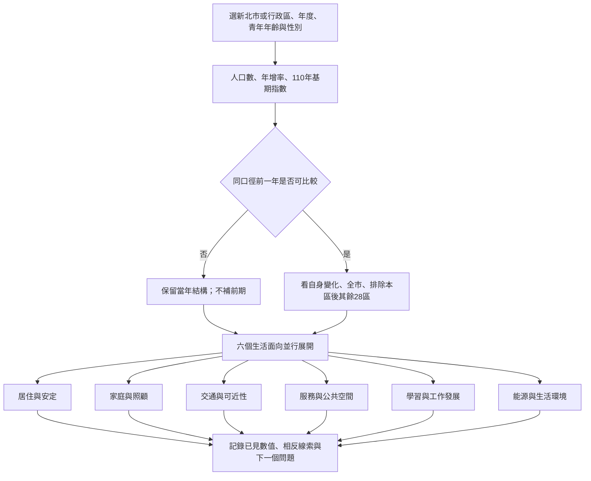
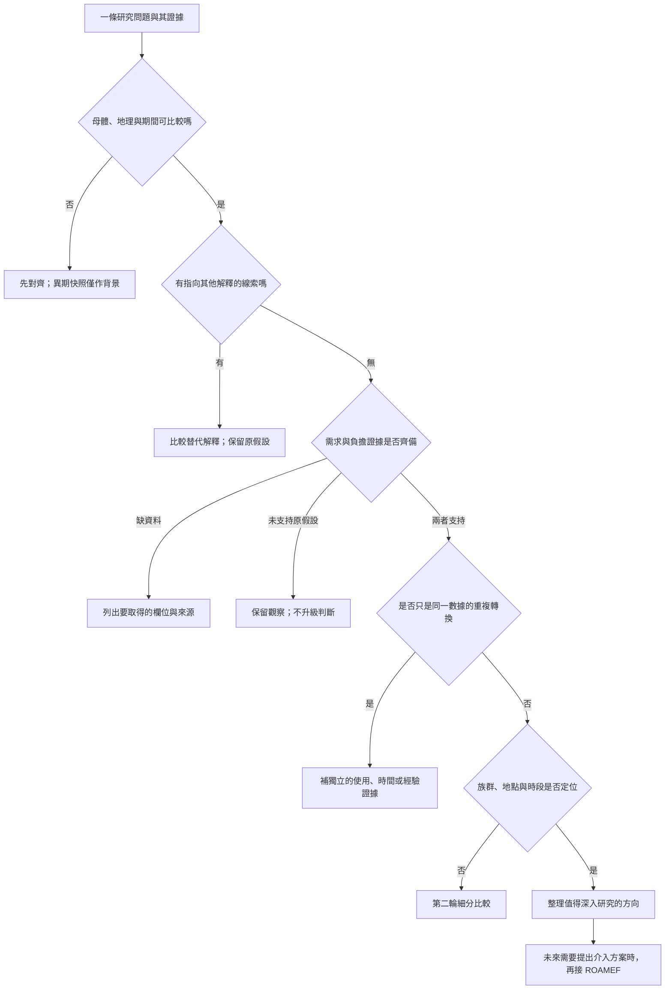

# 新北青年：生活條件與證據分流 V1

資料查核：2026-09-12｜UI：LSF V1｜資料：NTPC-LSF-DATA-V1-20260912｜規則：NTPC-LSF-RULES-V1

## 這次要解決什麼問題

看到某區青年人口增加，下一句不直接寫「新增據點」。先問：增加的人遇到什麼生活問題？住房、照顧、通勤或學習工作，有哪些資料支持這個問題？哪些資料指向另一個解釋？

本版完成可操作的本機原型、外部資料背景層與版本化分流規則。既有 ROAMEF、三母體、排名及原始公式保持不變。這是研究方向的整理，不是自動資源配置、政策成效預測或機器學習分類模型。

## 採用紐西蘭 LSF 的哪些做法

參考來源：[紐西蘭財政部 LSF Dashboard](https://lsfdashboard.treasury.govt.nz/wellbeing/)。採用「多面向生活條件」、「同一指標的群體與歷年比較」、「看到差異後展開證據」三個做法。

LSF 的跨領域個人分析使用同一份代表性調查。本案目前是不同母體的地區彙總資料，不能照搬個人福祉關聯、雷達分數或高低福祉分類。下列六條支線是本案在地化整理，不是紐西蘭官方六分類，也不是其官方門檻。

| 本案支線 | 對應 LSF 生活領域 | 本版可直接查看 | 下一份最有用的資料 |
| --- | --- | --- | --- |
| 居住與安定 | Housing | 115年3月各區四種租屋型態的租金分位數 | 同型態歷年租金、居民家戶收入、搬遷原因 |
| 家庭與照顧 | Family and friends；Work, care and volunteering | 所選青年婚姻結構、112–114粗出生率、114全年齡人口增減構成 | 0–5歲人口、家戶組成、托育容量與等候 |
| 交通與可近性 | Environmental amenity；Work, care and volunteering | 下一步資料清單，尚無數值圖 | 起訖旅次、通勤時間、班距、載客量與時段 |
| 服務與公共空間 | Leisure and play；Engagement and voice | 115年青年據點名錄、地址、官方連結及營運狀態 | 使用量、容量、開放時間、跨區利用與未使用原因 |
| 學習與工作發展 | Knowledge and skills；Income, consumption and wealth；Work, care and volunteering | 戶籍教育；全市另看勞動、行業最高占比及工作場所薪資 | 技能需求、求職意願、轉銜紀錄 |
| 能源與生活環境 | Environmental amenity | 下一步資料清單，尚無數值圖 | 住宅售電量、用戶數、氣溫、停電紀錄；不以發電量代替需求 |

LSF 的文化能力與歸屬、健康、安全、主觀福祉四個領域，本版沒有足以代表該領域的直接資料。其餘八個領域也只是部分背景線索，沒有完成整體福祉測量。自然環境另屬 LSF 的國家財富層，不誤列為上述十二生活領域之一。治理與長期資源存量留待後續擴充。

## 第一輪：從人口走向並行的研究問題

人口增加、減少或持平都能進入六條支線，不以「增加」作唯一入口。排序只方便閱讀，不以任意前20%取代需求證據。地區比較中，全市含本區，因此另外顯示排除本區後的28區合計；這仍不是因果對照組。

## 第二輪：決定應繼續查什麼，而非直接給方案

「支持」必須由該面向事先定義的同口徑比較、足夠樣本及實際需求資料決定，不能由 AI 自行填成 true。現有數值尚沒有同目標群體的需求與服務負擔配對，因此程式不會自動走到資源配置或新增設施。測試中的支持分支使用明確標記的合成條件，只驗證程式流程，不顯示在原型或發布CSV。

不同來源網址不一定代表獨立證據。例如人口數、密度、占比可能源自同一份人口表，不能算三份需求證據；同一行政資料的兩份再製報表也不能算獨立確認。

## 淡水示例：人口增加，不代表每種服務需求都增加

114年、18–35歲、性別合計：淡水43,000人，113年42,104人，增加896人、2.13%；全市年增率為−1.97%，兩者相差4.10個百分點。淡水110至114年增加5.08%。

另一方面，淡水全年齡粗出生率由112年的4.53‰降至114年的3.52‰，下降1.01個千分點。114年全年齡遷入減遷出為7,996人，出生減死亡為−718人；合計增加7,278人，與全區113、114年底人口差相符。以上不是青年的遷徙拆解。

下一步應分開追查：新遷入者的年齡與家戶組成、0–5歲人口、是否使用或等候托育、通勤地點與時段。粗出生率下降也不排除幼兒隨家庭遷入，不能據此排除照顧需求。

若將來「幼兒人口與照顧需求增加」且「候補或到達時間惡化」均有同口徑證據，第二輪才定位里別、兒童年齡與時段。若只有青年增加，則維持研究問題，不輸出「新增托育或青年據點」。

## 另兩個對照案例

| 114年18–35歲、合計 | 113年人口 | 114年人口 | 年增率 | 往下要問的問題 |
| --- | ---: | ---: | ---: | --- |
| 八里區 | 10,146 | 10,135 | −0.11% | 人口接近前期，是否仍有租屋、通勤或服務時段問題？ |
| 瑞芳區 | 7,640 | 7,329 | −4.07% | 是年齡跨出青年區間、遷移或其他原因？服務可達性是否改變？ |

八里是29區此條件下年增率最接近0的案例，不代表統計上沒有變化。固定年齡範圍的人數增減不是同一批人的追蹤，18歲進入、36歲離開也會改變總數。

## 公式與方法

- 人口年增率＝（本年底人口−前年底人口）÷前年底人口×100。
- 指數＝該年人口÷110年底同地區、同年齡性別人口×100。當分析窗縮短時，圖面標明其實際基期。
- 排除本區的28區年增率：先以全市人口減本區人口取得兩年人數，再算年增率，不平均各區百分比。
- 讀者看到的百分點差：先將兩個比率四捨五入至小數2位，再相減並保留2位；來源精度另存。整數人口不先改寫。
- 粗出生率＝全年出生數÷年中全年齡人口×1000，單位‰。不是生育率，也不是青年出生比例。
- 民政年報總增加率用年中人口分母（‰），與本案前年底人口分母的年增率（%）是不同指標，不直接混比。
- 租金第25、50、75百分位數描述樣本分布；不把分位數當作估計上下限、不平均各區中位數形成全市中位數。
- 新背景層只作官方值摘錄與加減除運算，沒有新增 PCLM、IPF 或 Sprague 模型。既有教育、婚姻、勞動與薪資模型原樣沿用，原上下限保留。
- 方法敏感度範圍重疊不等於統計檢定得到「無顯著差異」。本版不以重疊推定顯著性。

## 操作方式與可交付範圍

開啟本機原型後，先選範圍與青年條件；看人口趨勢，再點生活面向。下方左側顯示數值證據，右側顯示第二輪問題；支持證據可從右方抽屜展開。圖表有數值提示、可展開資料表、兩秒幾何過渡及減少動態效果支援。

本版尚未加入正式網站選單，沒有改公開／內網權限，也沒有部署。原型僅綁定127.0.0.1供本機確認。既有ROAMEF保持可用；未來整合時先做政策權限及匯出保護，再決定是否發布。
