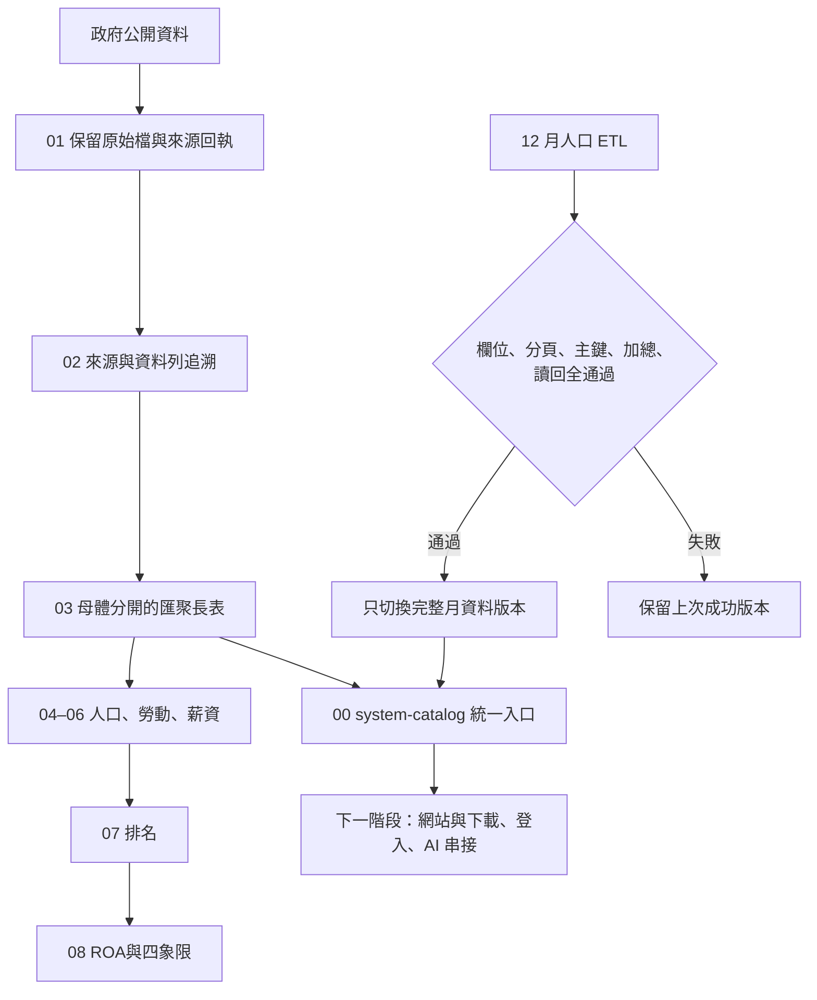

# 新版系統與 Gate 2 查核說明

## 本次完成到哪裡

資料與程式碼改為 00–14 的單一交付包；原 S3 672 個物件皆有逐檔遷移對照，不用再從五個散落資料夾找版本。ZIP 留在本機，不上傳。另增加必要公開原始資料、新北市教育婚姻原始列與月人口更新來源。

目前是「完整資料與原始碼整合」加上「月人口 ETL 上線驗證」，不是整個 AWS 網站已完成。年度自動更新、網站登入、AI 及內外權限仍不可標示完成。

## 重建查核

| 資料 | 既有筆數 | 重建結果 | 自動更新狀態 |
|---|---:|---|---|
| 戶籍人口 | 39,150 | 數值、分母、方法及身分一致 | 尚未啟用年度自動刷新 |
| 民間人口與勞動市場 | 180 | 數值、方法及來源身分一致 | 使用既有拆齡模型結果；新版模型重算待接通 |
| 工作場所薪資 | 32 | 數值、方法及來源身分一致 | 保留 110–113 年，不補造 114 年 |
| 政策服務與曝光 | 204 | 數值及既有缺值一致 | 據點現況頁與年報自動更新待接通 |
| 生活條件與公共服務 | 793 | 全欄位逐列一致；99 筆官方未提供值保留空白 | 新版年報及租金期別自動擷取待接通 |
| 月人口 | 24,480 | 11001–11508、30 地理層級、四年齡群組、三性別；全組合驗證 | Lambda 實跑通過；排程實際狀態見 13 |

戶籍人口 1,800 列、服務 6 列的組合來源雜湊因舊函式把「絕對路徑」納入計算而不同；不是數值或資料來源內容變更。既有正式長表不覆寫，新 ETL 改採內容雜湊與來源位置分開記錄。完整差異保留於 `rebuild-comparison.json`。

LSF 原方法驗證通過 61 項檢查；這是固定快照的重現測試，不等於所有官方網站已發布的最新版都重新抓過。新增月 ETL 有 19 項合成單元測試，涵蓋缺值、重複、分頁不足、年月錯誤、中英文欄位、加總、發布失敗及競態保護。測試資料不會進入正式資料。

## 更新與使用流程

## 尚需完成才能稱為完整上線系統

1. 年度資料自動化：各官方來源版本偵測、實際取回、模型重算、五長表與來源關聯同步發布。先維持已驗證快照，不能用「排程有建立」代表所有資料都更新。
2. 衍生資料：教育×婚姻、青年行業及行業薪資須與新年度原始資料共同重算，再連動兩份排名與 ROA；不單獨覆蓋一半結果。
3. 網站：將 09 的前端與後端入口改讀 00 的有效資料目錄；完成 AWS HTTP 服務與受控下載，再驗證所有頁面。
4. 權限：公開端不包含政策研判與政策輸出；內部授權以後端檢查，不能只靠前端隱藏。
5. AI：使用同一資料目錄、保留母體及來源身分；AWS 模型使用及速率依競賽允許範圍驗證。
6. 正式驗收：登入、八個入口、圖表、篩選、匯出、政策分流、手機操作、ETL 錯誤回復與排程到期處理。

## S3 清理與回復

新版全量上傳並讀回 SHA-256 後，才切換桶根 `00_CURRENT_SYSTEM.json`。再針對 `releases/20260912-roa-v1/` 的已映射物件重驗兩端內容，以 ETag 條件式刪除防止刪到後來改寫的資料。未映射或有差異者停止清除。

本機原始資料及 ZIP 保留；可利用 `14_歷史沿革與移轉紀錄/migration-map.json` 把新位置的相同內容複製回舊 Key。不要刪除未經確認的其他 S3 前綴、Workshop 函式或帳號資源。

## 主要操作參考

- 戶政司資料目錄：https://data.gov.tw/dataset/77132
- AWS 排程時區：https://docs.aws.amazon.com/scheduler/latest/UserGuide/schedule-types.html
- S3 條件式發布：https://docs.aws.amazon.com/AmazonS3/latest/userguide/conditional-writes.html
- S3 條件式刪除：https://docs.aws.amazon.com/AmazonS3/latest/userguide/conditional-deletes.html

以上 AWS 文件用於工程實作，不改變既有統計公式或政策分級門檻。
