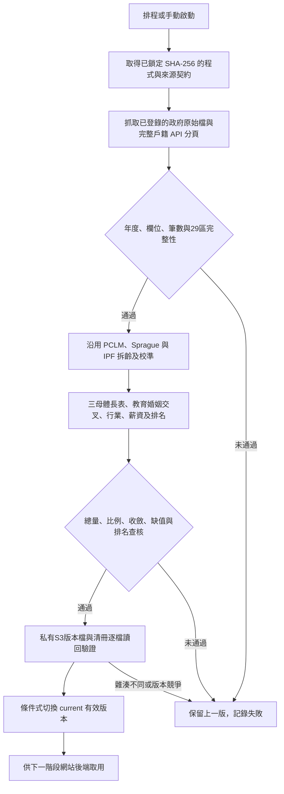

# 年度資料自動化：Gate 3

執行者：Codex。區域：us-west-2。資料仍放在同一份 `NTPC_Youth_System_V1_20260912` 的 00–14 結構；不修改原 ZIP、不上傳 ZIP、不改原網站與政策規則。

## 更新流程

## 本次涵蓋哪些資料？

| 資料 | 自動化內容 | 可用期間及邊界 |
|---|---|---|
| 每月戶籍人口 | 完整 API 分頁、29區、年齡與性別、長表及發布 | 已有每日09:15臺灣時間的 Lambda 排程；本次基準至115年8月 |
| 年底戶籍、教育、婚姻 | 官方原始列擷取、單歲／寬年齡解析、既有 PCLM/IPF、教育×婚姻交叉 | 110–114年 |
| 勞動市場 | 官方年度與半年度表，PCLM、Sprague、母數調和及敏感度檢查 | 110–114年；沿用原民間人口母體 |
| 青年就業者行業 | 官方行業及寬年齡表，依既有方法重建青年分析層 | 110–114年；居住於新北市的就業者 |
| 青年薪資與行業薪資 | 官方薪資表、勞保年齡及提繳工資輔助資料，重跑既有估計方法 | 110–113年；不補造114年青年薪資 |
| 行政區土地面積 | 已登錄官方 CSV 重新抓取 | 地理背景，不拆成青年面積 |
| 服務及據點 | 已驗證快照重建長表 | 新年報 PDF、新據點及人工整理欄位尚未全自動更新 |
| LSF 生活條件 | 既有原始快照、公式與來源查核重跑 | 112–114年及11503租金等原有期別；新期別解析待接通 |
| 地區與全市排名 | 從本次重建值重新計算兩份 CSV | 每個年齡、年度、性別分組重新排名 |

「已登錄年度自動重取」不等於「未來所有新年度自動適配」。目前年度契約為110–114年，薪資為110–113年；新表格、新年度與新版PDF仍須擴充並驗證解析器。來源發布了新年份但尚未納入契約時，不應稱現有資料已涵蓋最新年份。

## 查核內容

- 原始檔：政府 HTTPS 網址、擷取時間、檔案雜湊、完整分頁、年月與行政區代碼。
- 模型：總量與邊際相容、IPF/PCLM收斂、非負值、比率分子分母及原有敏感度紀錄。
- 數據：三母體不混用，缺值維持缺值，估計值不改成官方原生值。
- 排名：獨立重算29區13項指標，共22,620項排名查核。修正「新北市板橋區／板橋區」字串不一致造成重建缺值的問題，排名公式不變。
- 發布：輸出及清冊SHA-256讀回，條件式切換指標；任一失敗不覆蓋上一版。
- 保護測試：損壞資料、損壞清冊、禁止ZIP、私有加密、帳號限定及版本競爭。

37項固定基準比對已通過；模型保留10項既有敏感度警示。這代表既有計算可重現、查核未發現阻擋錯誤，不代表模型沒有估計誤差，也不代表政策效果已驗證。雲端與排程是否通過，以同目錄 JSON 驗收紀錄為準。

## 可重建的 AWS 架構

- 私有S3：原始來源、程式清冊、整批版本、查核回執及 current 指標。
- 月人口：既有 Lambda + EventBridge Scheduler。
- 年度批次：CodeBuild 小型 Linux 容器，無特權模式、同時最多1個批次、30分鐘上限。
- 權限：本案前綴唯讀；僅可寫年度版本、執行回執與有效指標；不得刪除資料。
- CloudWatch：保存批次日誌14天。
- 排程啟用前先實跑；不以「資源建立成功」代替「資料更新成功」。

CodeBuild／Scheduler設定依 [AWS CodeBuild API](https://docs.aws.amazon.com/boto3/latest/reference/services/codebuild/client/create_project.html) 與 [Scheduler通用目標指引](https://docs.aws.amazon.com/scheduler/latest/UserGuide/managing-targets-universal.html)；執行程式使用boto3，不使用AWS CLI。

## 操作入口

1. 初次移轉：使用00–14包內的既有S3建置與上傳程式，確認帳號、區域、私有存取與檔案完整性。
2. `prepare_bundle.py`：建立本次必要程式與來源的雜湊清冊。
3. `deploy_annual.py provision`：建立或更新限定本案的IAM、日誌及CodeBuild。
4. `deploy_annual.py start`：先實跑固定快照重建。
5. `cloud_progress.py`：讀取實際狀態及日誌。
6. `run_annual.py --refresh`：本機完整重取及重算驗證；加`--publish`且設定本案環境參數才發布。
7. `test_publication.py`：執行發布保護測試。

在同一帳號重建AWS批次環境時，不必重建本機工程資料夾：把`deploy_annual.py`與`bootstrap_annual.py`放在同一目錄，用`deploy_annual.py provision --bundle-key <驗收回執內的bundle_key>`，即可從已上傳且雜湊鎖定的程式與來源清冊建立批次環境；再執行`deploy_annual.py start --refresh`。`prepare_bundle.py`只在要重新打包來源／程式時使用。

政府網站的公開根憑證與中繼憑證另存於批次清冊，其完整鏈經本機既有信任庫及實際政府網域TLS驗證。僅供本案下載器補充信任鏈，不包含私鑰、不改電腦或容器全域信任設定，也不關閉HTTPS憑證驗證。

不把AWS存取金鑰寫進程式碼或前端。雲端批次使用執行角色，本機使用default憑證。Workshop帳號到期或資源被回收時，必須重新確認環境，不能保證排程永久運行。

## 下一個 Gate

先完成剩餘來源契約，再由網站後端讀取已驗證的年度／月度有效版本，連動ROA四象限衍生資料與網站快取，部署網站、身分驗證及公開／政策權限分層。既有網站原始碼仍保留在09，本關沒有冒稱AWS網站已上線。
