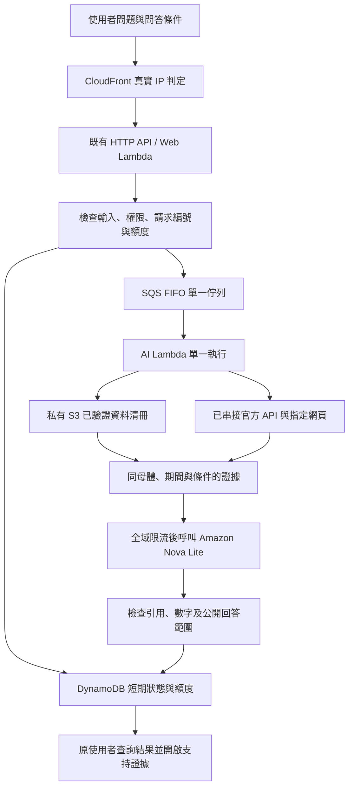

# AWS V1.0 資料問答

新增真實 Amazon Bedrock 問答，沿用既有網站與私有資料發布流程，不修改母體、資料值、排名或 ROA 規則。

## 如何使用

1. 從網站右上角「AI 問資料」開啟右側面板。
2. 確認問答的年度、年齡、性別、行政區。ROA 已套用的條件會傳給問答；其他分析圖有獨立篩選時，以面板明列的問答條件為準。
3. 選擇「平台＋已串接的外部官方來源」或「只查平台資料」。問題若明確寫出單一年齡、年度或行政區，優先使用問題中的條件，並在答案上顯示實際查詢條件。
4. 點回答旁的 P/E 引用，查看平台數值、支持圖表／資料表或外部官方摘錄。P 是平台數據，E 是外部官方來源。

可問：

- 114年淡水區30–35歲人口與前一年相比如何變化？
- 113年新北市18–35歲薪資中位數是多少？
- 決策內網：淡水區30–35歲人口增加，托育有哪些官方資料可參考？

公開入口只回答數據、方法及官方既有服務；IP 白名單的決策內網可額外整理一項研析方向。AI 不負責重新分級或核定政策，ROA 四象限仍使用原本的確定性規則。

## 實際雲端架構

- 模型：`amazon.nova-lite-v1:0`，只在 `us-west-2` 呼叫，不使用跨區推論。
- 工作 Lambda：`ntpc-youth-ai-v1`，120秒／1024MB／保留同時執行數1。
- SQS：`ntpc-youth-ai-v1.fifo`，同一 MessageGroup，BatchSize=1，訊息保留15分鐘，完成即由 Lambda 事件來源刪除。
- DynamoDB：`ntpc-youth-ai-v1`，隨用隨付、加密，答案30分鐘後不再可讀；TTL 背景刪除可能較晚，應用程式會先拒絕逾期讀取。
- 不使用新的公有 S3、向量資料庫、OpenAI 帳號金鑰或額外第三方搜尋服務。

## 外部資料範圍

競賽提供的服務清單列有 Bedrock、bedrock-mantle、Lambda、SQS、DynamoDB，但未列 `bedrock-websearch`。因此本版不開啟 Bedrock 原生 Web Search，也不宣稱具備全網即時搜尋。

本版按問題主題從 `ai-official-sources.json` 選取最多3個經程式碼審查的來源，當次即時讀取。來源包括公共托育／親子中心名冊 API、交通局、職涯案例、婚姻資源、主計總處與 LSF 等。讀取失敗、遭網站拒絕、格式改變或沒有相關正文時，不拿它當回答依據，並在收合區顯示未取得項目。

官方名冊只傳設施名稱、地區、設施地址；不傳聯絡人或電話。名冊回傳筆數不等於可用名額、實際使用量或需求缺口。原始名冊沒有統計年度時，標示本次查詢名冊，不套用使用者所選人口年度。網頁內容是相關摘錄，不保證讀到所有附件或完整統計表。

外部資料只用於本次問答，不自動寫回匯聚 CSV、ETL 清冊、政策排名或 ROA 四象限。若要正式納入指標，仍需另走原有來源、欄位與品質驗證流程。

## 權限、資料與費用保護

- IP 判定沿用 CloudFront 真實來源，不能用瀏覽器提交的 IP 或角色取得內網權限。
- 每次回答綁定隨機瀏覽工作階段及經 CloudFront 驗證的網路位置；更換工作階段或網路位置不能讀取原答案。內網答案讀取時再次檢查 IP。
- 公開模式不提供政策研判與資料匯出，也不載入私有政策報告。內網問答不具資料寫回能力。
- 前後端攔截常見證號、信箱、手機號、憑證及私人資料輸入。這是基本防護，不能保證辨認所有個資；使用介面明確要求僅輸入公開彙總資料問題。
- 原始問題隨工作訊息暫存於加密 SQS，最長15分鐘；完成即移除，不寫進應用程式日誌。答案與證據短期存在 DynamoDB。不是完全零儲存。
- 只給 AI Lambda 私有發布資料的讀取權、指定 Nova Lite 模型呼叫權及本案佇列、狀態表、日誌權限；沒有 S3 寫入權。
- 全域模型租約＋單一消費者；每次呼叫完成後至少等待2.1秒才允許下次呼叫。SDK 自動重試關閉；失敗不密集重試。單一 Lambda 併發限制並非唯一限流措施。
- 初始額度：每一公網 IP 每小時20題、全站每日200題。多人共用同一公司公網 IP 時共用每小時額度。此為防濫用初始設定，可由管理員調整程式常數。
- 模型的引文只能來自當次取得的來源 ID，不接受模型自創網址。未出現在引用證據中的數字會排除。這是輔助檢查，並非完整語意或因果驗證。
- 外部網址固定於程式碼清冊，不接受使用者或模型指定任意網址、不追蹤 HTTP 重新導向，也不授權網頁內容執行任何動作。
- 「停止等候」只停止瀏覽器輪詢，不會回收已發出的模型請求或取消已發生費用。

## 更新與驗收

修改 `ai_evidence.py`、`ai_chat.py` 與來源清冊後，先跑 `tests/test_ai.py`；前端建置公、內網兩份。以 `deploy_ai.py` 更新專用資源，再以 `deploy.py provision` 更新原網站 API，最後上傳前端。

驗收紀錄：`ai-cloud-verification.json` 為正式 CloudFront 端到端測試；`cloud-verification.json` 為既有網站與權限檢查；`ai-local-verification.json` 保存後端與圖表回歸結果，以及完整專案 TypeScript 診斷。公、內網正式建置可完成，但完整專案仍有舊頁面型別診斷，未宣稱全專案型別檢查通過。模型回覆品質需看實際文字，不只看 HTTP 成功。原始 Weekly Blend 網站不更動。

Nova 使用[指定工具的結構化輸出](https://docs.aws.amazon.com/nova/latest/userguide/tool-choice.html)回傳答案。數據重點先由來源欄位生成事實卡，模型只選擇相關 `factId`，伺服器回傳該卡原文及來源，模型不能改寫年度與數字。外部名冊的查詢期別與人口年度分開；網頁摘錄沿用取得的原文，不由模型補充未取得的資訊。「可進一步探討」由模型整理、另驗證引用及數字，只在內網顯示。這個工具僅定義答案格式，不執行檔案、SQL、網頁或 AWS 操作。

官方架構參考：[Bedrock Converse](https://docs.aws.amazon.com/bedrock/latest/userguide/conversation-inference.html)、[Web Search 與資料存取範圍](https://docs.aws.amazon.com/bedrock/latest/userguide/web-search.html)、[Web Search IAM](https://docs.aws.amazon.com/bedrock/latest/userguide/security-web-search.html)。
