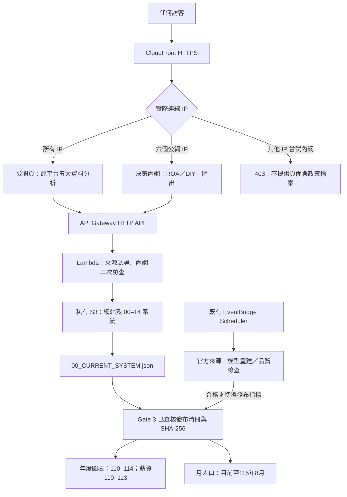

# 新北青年資料證據台：AWS V1.0

2026/09/12 地圖修補：政策頁排除官方 GeoJSON 中額外的「全區」輪廓，僅繪製與資料清單一致的29個行政區；保留原始座標、鍵盤與下拉選區。切回行政區分流時重新顯示地圖。人口資料與 ROA 公式不變，驗證紀錄見 `map-verification.json`。

同日追加地圖焦點修補：滑鼠點選不再出現 SVG 外側矩形框；選取及鍵盤焦點以行政區深藍輪廓呈現，鍵盤焦點寬度5px。其他控制項的焦點框保持原樣。

公開入口：https://YOUR_DISTRIBUTION.cloudfront.net/

IP 限定內網：https://YOUR_DISTRIBUTION.cloudfront.net/internal/?view=policy

## 保留什麼、改了什麼

此版本由 Weekly Blend 的 G6 UI V5.32 原始碼複製，不是另製展示模板。保留全市人口、29 區地圖、教育與婚姻、就業／失業、青年行業、薪資、自訂分析、篩選匯出，以及原圖表與鍵盤操作。

只在 AWS 副本改動網站承載、存取判斷、資料入口及政策研判。政策頁使用 R 資料依據 → O 關注目標 → A 四象限及未來研擬方向，不呈現 M、E、F。原始 ROAMEF 程式仍留在來源封存供追溯，未作為目前政策頁入口。

UI/UX 調整沿用原深藍與青綠、12px 卡片、固定對齊的 R/O、可展開來源與資料表、鍵盤選區及手機抽屜，沒有另換後台模板。

## 架構

CloudFront 使用 viewer.ip，不信任瀏覽器送來的 X-Forwarded-For。Lambda 只接受 CloudFront 私有來源驗證值，並重新檢查內網 IP。內網與 API 不共用快取。S3 四項 Block Public Access 仍全部啟用；CSV、原始碼、官方原始檔不直接成為公開 S3 網站。

## 六個白名單公網 IP

| 公網 IP | 說明 |
|---|---|
| 192.0.2.1 | 本次從使用者電腦確認的對外 IP |
| 192.0.2.2 | 使用者指定 |
| 192.0.2.3 | 使用者指定 |
| 192.0.2.4 | 使用者指定 |
| 192.0.2.5 | 使用者指定 |
| 192.0.2.6 | 使用者確認：172.21.10.170，閘道172.21.0.1的公網出口 |

同一 NAT 出口下的其他電腦也會獲准；這是網路白名單，不是個人或裝置身分識別。不需要 Google OAuth、帳密或 profile 名稱。IP 改變時，更新 deploy.py 的 IPS 並重新 provision。IPv6 入口未啟用，避免 IPv4 白名單被不同路徑繞過。

## 資料及 ROA 計算

網站初次載入讀取一份通過查核的年度批次及最新月度資料；Lambda 60 秒重讀發布入口。資料更新不用重新編譯網站。年度批次與月資料不同時間基準分開標示。人口、勞動及薪資母體不互作分母，行政區頁不分配全市勞動或薪資。

四象限規則來自原 08_ROA與四象限的 ROA-RULES-V1-DRAFT，仍為初步關注分級，不是已驗證的因果風險模型。行政區基準是同條件29區中位數；全市是110–114年平均，薪資使用110–113年。使用顯示至小數2位的數值計算差距；區間跨越門檻或缺值不落入象限。115年據點快照不能回填110–114年據點。

2026/9/13加入「數值可比較、象限尚未固定」說明：逐軸顯示點值、範圍、門檻，將缺年度、期間不同與估計跨界分開。跨界時可看虛線的點估計參考位置，但正式象限仍留空。概念提案改由所選地區／族群、人口與密度、婚姻／教育類別及已查核地方背景共同整理；不把每個地區套成同一份建議。詳見 `ROA四象限說明與地方依據_V1.1.md`。

`roa-context.json`是具來源指紋的獨立背景快照，由`build_roa_context.py`讀取原LSF長表建立。人口、出生率、租金的母體及期間仍分開；缺租金不補值。此背景沒有新增自動ETL，須查核新期來源後重建。`/api/roa/context`受原IP白名單保護，公開程式不包含政策方向。例行只改網站時，可用`python deploy.py update-code`更新既有Lambda程式，再執行`upload`；不需要重設IAM及CloudFront。測試紀錄在`roa-local-verification.json`與`roa-ui-verification.json`。

## 可重建原始碼

- `dashboard/`：完整儀表板副本及 AWS 適配；來源資料由已驗證的 S3 清冊讀入。
- `dashboard/aws-entry.tsx`、`vite.aws.config.mts`：公開／內網分別編譯；內網 JS 只在 `/internal/` 供應。
- `dashboard/app/aws-roa*`：ROA 介面、計算與樣式。
- `server.py`：AWS API、來源驗證、月資料及檔案白名單。
- `deploy.py`：boto3 建立或更新本案 IAM、Lambda、API Gateway、CloudFront Function 與網站上傳。
- `roa-rules.json`：沿用的分級規則。
- `tests/`、`dashboard/tests/aws-*`、`verify_cloud.py`：權限與資料計算檢查。

先使用 Node 22.13+ 與 Python 3.12+，執行 `npm ci`（dashboard內）、`npm run build`。在上層使用 `python deploy.py provision`、`python deploy.py upload`、`python verify_cloud.py`。首次執行 verify_cloud 會產生 live-bootstrap.json，供 `npm test` 驗證實際發布資料。boto3 使用 default 憑證與 us-west-2，不需 AWS CLI。

本機開發可將 `/api`、`/auth`、`/data` 代理至已部署的 HTTPS 網站；本機預覽不能取代 AWS 白名單驗收。來源驗證值只在 AWS 設定中，不輸出、不寫入版本庫。此部署腳本目前鎖定已確認的帳號與 bucket，跨帳號須先明確設定，避免誤傳資料。

## 本 Gate 範圍與後續

AI 問答已接上 Amazon Bedrock Nova Lite，先讀取已查核資料，再按問題查詢已串接的官方 API／網頁。每個重點須附來源，可點開支持數據與資料表；內網另提供可探討方向，公開版不回傳政策建議。完整流程、費用控制及資料保留方式見 `AI問答操作與架構_V1.md`，實際驗證見 `ai-cloud-verification.json`。這不是全網搜尋，未啟用未列在競賽允許清單中的 Bedrock WebSearch。既有 CSV 與 ROA 分級規則不由 AI 改寫。

部署問答需另執行 `python deploy_ai.py`，建立本案專用 SQS FIFO、DynamoDB 及模型工作 Lambda；後端將數據欄位組成帶有來源的事實卡，模型只選擇相關卡片，避免年度與數字配對錯誤。內網探討方向另經引用與數字檢查。模型無資料寫入權限。可用 `python verify_ai_cloud.py` 執行固定公開資料測試。

原站自訂網域不轉移，本次新增 CloudFront 網址；如需正式網域，另確認 DNS 設定。

現有年度 ETL 仍以已建立來源合約重建已知年度；遇新年度版型、未完成介接的服務資料，依 Gate 3 邊界處理。不能將網站上線解讀為所有未知新資料都已可無人處理。

AWS 官方機制：[CloudFront viewer.ip](https://docs.aws.amazon.com/AmazonCloudFront/latest/DeveloperGuide/functions-event-structure.html)、[HTTP API 與 Lambda](https://docs.aws.amazon.com/apigateway/latest/developerguide/http-api.html)。
