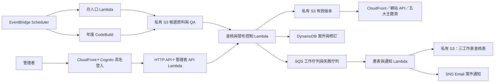
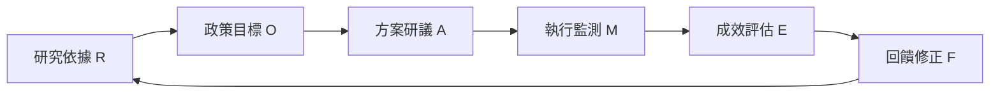

# AWS 資料與簽核架構

發布控制器保留併發 1，依案件修訂、清冊雜湊及 S3 ETag 控制版本切換。產表與通知另經 SQS 重試，避免暫時寄信失敗阻塞資料查核。IAM 權限按元件責任分開；CloudWatch 保存執行日誌與告警。

管理者核可對應特定候選雜湊，發布前再次驗證資料。若來源、候選內容或有效版本已改變，須重新復驗。SNS 訂閱確認與第一次管理者密碼設定由收件人完成。

五大主題：全市人口結構、29 區人口結構、就業與失業、青年就業行情、青年薪資。各頁採四個摘要圖表與一個主要圖表；比較前先核對年度、年齡、性別、地區及統計母體。

決策樹先分全市／29 區，再核對資料完整性、比較基準及敏感度。四象限以各議題的 X／Y 條件成立與否分流；數值方向依議題定義，不將所有「較高」都視為高風險。證據不足或敏感度跨越門檻時，不強制固定象限。
